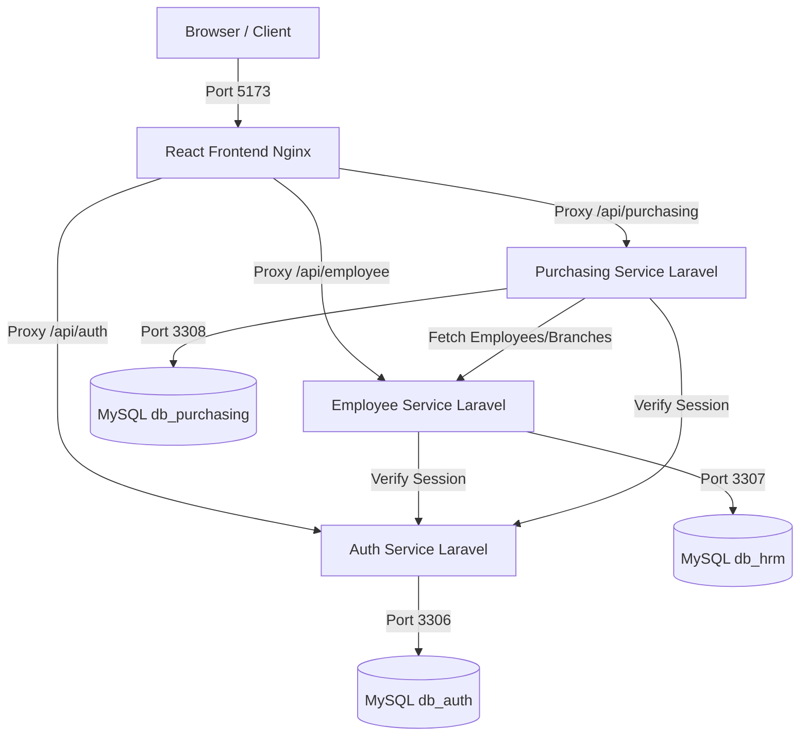

# PT. Anyar Retail Group - ERP Microservices Stack

Welcome to the **PT. Anyar Retail Group ERP Microservices Stack**. This repository contains a fully containerized microservice suite running a React frontend, 3 Laravel backend API microservices, and 3 dedicated, isolated MySQL databases.

---

## System Architecture



---

## Services & Ports Mappings

The entire stack is configured via the root [docker-compose.yml](file:///d:/My%20Document/PT.%20Anyar%20Retail%20Group/PROJECT/docker-compose.yml) and runs on the following ports:

| Service Name | Description | Host Port | Container Port | Build Directory | DB Connected |
| :--- | :--- | :--- | :--- | :--- | :--- |
| **frontend** | React + Vite served via Nginx | **5173** | 80 | [fe-host](file:///d:/My%20Document/PT.%20Anyar%20Retail%20Group/PROJECT/fe-host) | *None (Relative Proxy)* |
| **auth-service** | Authentication, JWT issue, Users API | **8001** | 8001 | [auth_service](file:///d:/My%20Document/PT.%20Anyar%20Retail%20Group/PROJECT/auth_service) | `db_auth` (on `mysql-auth`) |
| **employee-service** | HRIS, Branches, Employees, Positions | **8002** | 8002 | [employee_service](file:///d:/My%20Document/PT.%20Anyar%20Retail%20Group/PROJECT/employee_service) | `db_hrm` (on `mysql-employee`) |
| **purchasing-service** | Purchasing, Vendors, Items, POs | **8003** | 8003 | [purchasing_service](file:///d:/My%20Document/PT.%20Anyar%20Retail%20Group/PROJECT/purchasing_service) | `db_purchasing` (on `mysql-purchasing`) |
| **mysql-auth** | MySQL 8.4 Database for Auth | **3306** | 3306 | *Pre-built MySQL image* | - |
| **mysql-employee** | MySQL 8.4 Database for HRIS | **3307** | 3306 | *Pre-built MySQL image* | - |
| **mysql-purchasing** | MySQL 8.4 Database for Purchasing | **3308** | 3306 | *Pre-built MySQL image* | - |

---

## Prerequisites

Ensure you have the following installed on your machine:
- **Docker Desktop** (supporting Docker Compose v2+)
- **Git**

---

## How to Run the Entire Stack

To spin up all backend services, databases, and the frontend, run a single command in the root folder:

```bash
docker compose up -d --build
```

This command will:
1. Build the Docker image for the React frontend, caching packages.
2. Build the Docker images for the 3 Laravel services with required PHP extensions (`pdo_mysql`, `zip`).
3. Start 3 separate MySQL containers and import their respective SQL dumps from `./mysql/init/` to initialize schemas and seed records.
4. Inject all cross-service URLs and credentials using environment overrides.

### Shutting Down the Stack

To stop and remove all containers and networks, run:

```bash
docker compose down
```

To stop and remove containers **along with database volumes** (wiping the database back to initial seed data):

```bash
docker compose down -v
```

---

## Verifying Database and Services

### 1. Database Connections
You can connect to each isolated database from your host machine using any DB client (e.g. DBeaver, TablePlus, or command line):
- **Auth DB:** Host: `127.0.0.1`, Port: `3306`, Database: `db_auth`, User: `root`, Password: `root`
- **HRIS DB:** Host: `127.0.0.1`, Port: `3307`, Database: `db_hrm`, User: `root`, Password: `root`
- **Purchasing DB:** Host: `127.0.0.1`, Port: `3308`, Database: `db_purchasing`, User: `root`, Password: `root`

### 2. Frontend Interface
Open your browser and navigate to:
```url
http://localhost:5173
```
- **Login Credentials:**
  - **Superadmin:** `admin@example.com` / Password: `password` (hashed locally in database)
  - **Admin HRD:** `hrd@example.com` / Password: `password`
  - **Admin Purchasing:** `purchasing@anyar.co.id` / Password: `password`

### 3. Postman Collections
Postman collections are provided at the root of the project to test APIs independently:
- [AUTH SERVICE.postman_collection.json](file:///d:/My%20Document/PT.%20Anyar%20Retail%20Group/PROJECT/AUTH%20SERVICE.postman_collection.json)
- [EMPLOYEE SERVICE.postman_collection.json](file:///d:/My%20Document/PT.%20Anyar%20Retail%20Group/PROJECT/EMPLOYEE%20SERVICE.postman_collection.json)
- [PURCHASING SERVICE.postman_collection.json](file:///d:/My%20Document/PT.%20Anyar%20Retail%20Group/PROJECT/PURCHASING%20SERVICE.postman_collection.json)
