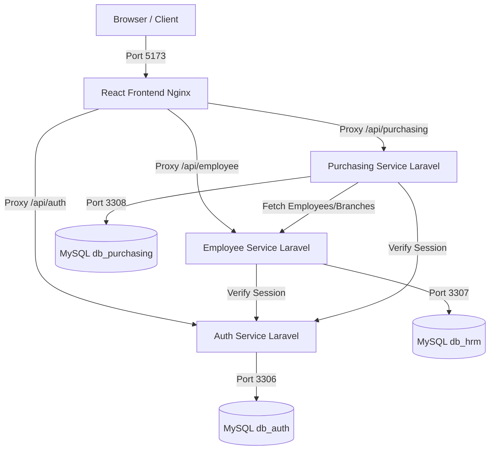

# PT. Anyar Retail Group - ERP Microservices Stack

Welcome to the **PT. Anyar Retail Group ERP Microservices Stack**. This repository contains a fully containerized microservice suite running a React frontend, 3 Laravel backend API microservices, and 3 dedicated, isolated MySQL databases.

---

## System Architecture



---

## Services & Ports Mappings

The entire stack is configured via the root [docker-compose.yml](https://github.com/TeguhA10/test_project_anyar_group/blob/main/docker-compose.yml) and runs on the following ports:

| Service Name | Description | Host Port | Container Port | Build Directory | DB Connected |
| :--- | :--- | :--- | :--- | :--- | :--- |
| **frontend** | React + Vite served via Nginx | **5173** | 80 | [fe-host](https://github.com/TeguhA10/fe-host) | *None (Relative Proxy)* |
| **auth-service** | Authentication, JWT issue, Users API | **8001** | 8001 | [auth_service](https://github.com/TeguhA10/auth_service) | `db_auth` (on `mysql-auth`) |
| **employee-service** | HRIS, Branches, Employees, Positions | **8002** | 8002 | [employee_service](https://github.com/TeguhA10/employee_service) | `db_hrm` (on `mysql-employee`) |
| **purchasing-service** | Purchasing, Vendors, Items, POs | **8003** | 8003 | [purchasing_service](https://github.com/TeguhA10/purchasing_service) | `db_purchasing` (on `mysql-purchasing`) |
| **mysql-auth** | MySQL 8.4 Database for Auth | **3309** | 3306 | *Pre-built MySQL image* | - |
| **mysql-employee** | MySQL 8.4 Database for HRIS | **3307** | 3306 | *Pre-built MySQL image* | - |
| **mysql-purchasing** | MySQL 8.4 Database for Purchasing | **3308** | 3306 | *Pre-built MySQL image* | - |

---

## Prerequisites

Ensure you have the following installed on your machine:
- **Docker Desktop** (supporting Docker Compose v2+)
- **Git**

---

## How to Run the Entire Stack

To spin up all backend services, databases, and the frontend, run a single command in the root folder:

```bash
docker compose up -d --build
```

This command will:
1. Build the Docker image for the React frontend, caching packages.
2. Build the Docker images for the 3 Laravel services with required PHP extensions (`pdo_mysql`, `zip`).
3. Start 3 separate MySQL containers and import their respective SQL dumps from `./mysql/init/` to initialize schemas and seed records.
4. Inject all cross-service URLs and credentials using environment overrides.

### Shutting Down the Stack

To stop and remove all containers and networks, run:

```bash
docker compose down
```

To stop and remove containers **along with database volumes** (wiping the database back to initial seed data):

```bash
docker compose down -v
```

---

## Verifying Database and Services

### 1. Database Connections
You can connect to each isolated database from your host machine using any DB client (e.g. DBeaver, TablePlus, or command line):
- **Auth DB:** Host: `127.0.0.1`, Port: `3309`, Database: `db_auth`, User: `root`, Password: `root`
- **HRIS DB:** Host: `127.0.0.1`, Port: `3307`, Database: `db_hrm`, User: `root`, Password: `root`
- **Purchasing DB:** Host: `127.0.0.1`, Port: `3308`, Database: `db_purchasing`, User: `root`, Password: `root`

### 2. Frontend Interface
Open your browser and navigate to:
```url
http://localhost:5173
```
- **Login Credentials:**
  - **Superadmin:** `admin@example.com` / Password: `password123` (hashed locally in database)
  - **Admin HRD:** `hrd@example.com` / Password: `password123`
  - **Admin Purchasing:** `purchasing@anyar.co.id` / Password: `password123`

### 3. Postman Collections
Postman collections are provided at the root of the project to test APIs independently:
- [AUTH SERVICE.postman_collection.json](https://github.com/TeguhA10/test_project_anyar_group/blob/main/AUTH%20SERVICE.postman_collection.json)
- [EMPLOYEE SERVICE.postman_collection.json](https://github.com/TeguhA10/test_project_anyar_group/blob/main/EMPLOYEE%20SERVICE.postman_collection.json)
- [PURCHASING SERVICE.postman_collection.json](https://github.com/TeguhA10/test_project_anyar_group/blob/main/PURCHASING%20SERVICE.postman_collection.json)

---

## Git Submodule Management

This project uses Git Submodules to manage the separate microservices. When working with submodules, follow these guidelines:

### 1. Cloning the Repository
When cloning this repository for the first time, you must include the `--recursive` flag to clone all submodules along with the main repository:
```bash
git clone --recursive https://github.com/TeguhA10/test_project_anyar_group.git
```

If you have already cloned the repository without the submodules (leaving the directories empty), run:
```bash
git submodule update --init --recursive
```

### 2. Updating Submodules to Latest Commit
To pull the latest changes for the main repository and synchronize all submodules to the exact commits tracked by the main repository:
```bash
git pull origin main
git submodule update --init --recursive
```

To update submodules to their own remote `main` branch heads:
```bash
git submodule update --remote --merge
```

---

## Docker & MySQL CLI Usage

All services and databases are isolated in Docker containers. Here are useful CLI commands for management:

### 1. Accessing MySQL Database inside Docker Containers
You can log in to any database CLI directly using `docker exec`:

- **Auth Database CLI**:
  ```bash
  docker exec -it mysql-auth mysql -u root -proot db_auth
  ```
- **Employee (HRIS) Database CLI**:
  ```bash
  docker exec -it mysql-employee mysql -u root -proot db_hrm
  ```
- **Purchasing Database CLI**:
  ```bash
  docker exec -it mysql-purchasing mysql -u root -proot db_purchasing
  ```

### 2. Refreshing/Re-initializing Databases
The databases are seeded using the SQL dumps located in `./mysql/init/` on initial creation. If you modify these SQL dump files or need to completely wipe and re-initialize the databases, run:
```bash
# Hentikan dan hapus volume database lama
docker compose down -v

# Jalankan ulang kontainer, ini akan memicu re-inisialisasi dari file SQL di mysql/init/
docker compose up --build -d
```
